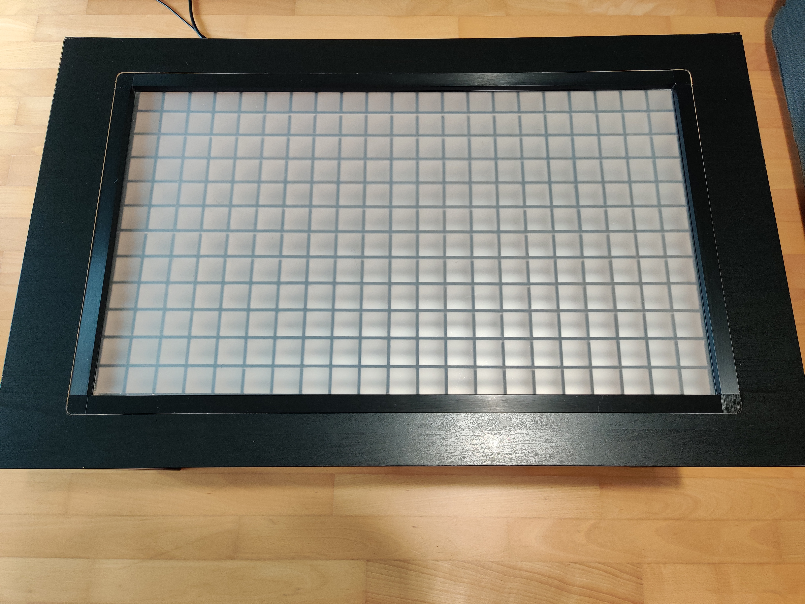

# FancyTable

This project transforms an ordinary IKEA LACK Coffee table to a smart lighting table.

## IKEA LACK
We use an IKEA LACK table because it only consists of cardboard inside. After cutting out a hole in the top, the cardboard can easily removed and creates enought space for the lighting.

## Lighting
The lighting consists of smart WS2812B 5050 RGB LEDs. These LEDs can be addressed individually. We arrange the LEDs as grid and seperate them from each other. On top will be placed a frosted glas plate or satined plexiglass, to diffuse the light and create some kind of pixel pattern.

## Smart functionality
We will use an Raspberry Pi to controll the LEDs. A simple microcontrolle would be  sufficient but we want additionally host a multitouch input device and a webpage for controlling.

#How To
Now I will guide you through the process to build your own FancyTable. This is not an exact step-by-step instruction. I just give you an overview of the process. Think, measure everything and act by your own.

## Disclaimer
I do not take any response for accidents, damages or injuries. The system is encapsulated between cardboard and can produce a certain amount of heat. Working with wall power should just be done by experienced people.

## Preparation
We will need following things:
- IKEA LACK (https://www.ikea.com/us/en/catalog/products/00095036/) 29.99$
- 5V WS2812B 5050 RGB LED Strip 60 LEDs/m (Approx. 10 meters) ~30.00$
- IR Multi Touch Frame 32 inch (https://www.aliexpress.com/item/32-inch-USB-IR-Multi-touch-screen-overlay-for-kiosk-lcd-10-points-Infrared-multi-touch/32808998626.html) ~100.00$
- Raspberry Pi (Additional SD Card) ~50.00$
- 5V 15A Powersupply ~15.00$
- construction materials ??.??$
  - Metal sheet 750mmx450mmx1mm
  - Wood panels (I've used a 3-layer board, which I wouldn't recommend. Maybe MDF fits better)
  - Acrylic plate 750mmx450mmx3mm
  - Some cables and other electrical stuff

## Build
### Open the table

The IKEA LACK Table consits of thin wooden layers 2-3mm on the top and bottom. Between there is a honeycomb cardboard. You need to cut a hole in the top, with the same shape as the outer contours of the IR Touch Frame. The top layer is glued to the cardboard, so it takes some time to get it off. Then you can remove the cardboard in this hole.

The sizes of the Metal sheet and acrylic plate could vary by the size of your IR frame.

### Prepare electronics

Cut the LED strips in 12 pieces with 21 leds each. Place them evenly on the metal sheet, such that each led has a distance of 12mm to the one above/below. That should be the same distance to the next led on the same strip. Start the input of the data line in the top left corner. For each row swap the direction of the data line, such that a continuous chain exits. Place some electrical tape between each end of an led strip and the metal sheet. The cut may damage the isolation and cause contact between the strips and the sheet.

Solder data cables from the output of an strip to the input of the next strip. Solder the power cables on the left side of the strips and connect them (they should be capable to conduct up to 15A).

Find some way to connect the power line with the power supply. I placed the supply on the bottom of the table plate and drilled a hole in the upper left corner. But if you do that, the contacts of the power supply are exposed which is dangerous.

Connect the data input with pin 18 of the raspberry.

### Prepare grid walls

I've cut some planks out of the wooden plate with notches, to put them together as a grid. The CAD-file has a bit tight measures, so I hat to grind everything. Maybe you have a better idea to get a nice grid.

The walls should have the right height, such that metal sheet, grid, acrylic plate and IR touch frame stacked on each other should have the same height as the depth of the hole. In the end the frame should be plane with the upper plate of the table.

### Wire the Pi
You can connect the 5V and ground pins to he power supply. But in my case there have been flickering effects due to fault currents. So I've connected the Pi to a separate USB power supply. But don't forget to connect ground of Pi and LED strips.

Connect the IR touch frame with the Pi.

### Install the software
It could be possible, that the IR touch frame requires some drivers to work. So test it with a display if you can use it as an input device.

Install python3 and requirements.txt. Launch the software by `python3 TableControl.py <device path>`. The device path is the systems device input path to your touch frame (e.g. `/dev/input/event1`).

### Pack everything together

Place the Pi on the side in the table. Insert the metal sheet with LEDs. Place the grid on top. Afterwards the acrylic plate. Placing the IR touch frame on top could be a bit tricky since you have to manage the cable.

### That's it
Now everything should be connected and placed together. But test everything in advance.
